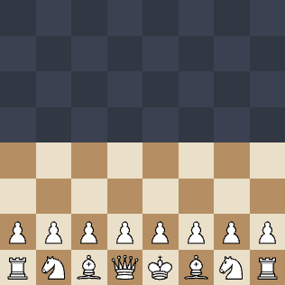

# Fog Chess

Play fog-of-war chess in your browser against
[Obscuro](https://github.com/opowell/obscuro-chess), an AI built for it. In fog
chess you see only the squares your own pieces can move to, and you win by
capturing the enemy king. There is no check or checkmate.



## Play

You need [Node.js](https://nodejs.org) 22 or later and git.

```sh
git clone --recurse-submodules https://github.com/opowell/fog-chess.git
cd fog-chess
./start.sh          # macOS, Linux
start.cmd           REM Windows
```

Open http://localhost:4510/fog-chess. Nothing needs installing: every
dependency is committed or vendored, the Stockfish engine included. Set
`PORT` to use a different port.

If you cloned without `--recurse-submodules`, the launcher fetches the
submodules itself the first time it runs.

### What the page offers

- **New game:** play White, Black or a random colour. Pick an AI strength from
  0 (random moves) to 100 (about 2 seconds a move). The default is 25.
- **Show where the enemy might be:** shades each dark square by the chance an
  enemy piece stands there, and labels it with the likeliest piece. The numbers
  come from *your* information only: every position consistent with what you
  have seen, weighted by how likely each is. They say nothing the fog doesn't
  already allow you to work out.
- **Markers:** right-click a dark square (or long-press it on a touch screen)
  to leave yourself a reminder of what you think is there.
- **Resuming:** a reload picks your game back up. Games live in the server's
  memory, so restarting the server ends them.

When the game ends the fog lifts and the whole board is shown.

## How it is put together

| Path | What it is |
| --- | --- |
| `apps/fog-chess/` | The app: the page (`index.html`, `main.js`, `style.css`), and the server side (`server.js`, `games.js`) |
| `vendor/jas/` | [JAS](https://github.com/opowell/jas), the small app server that hosts it (submodule) |
| `vendor/obscuro-chess/` | [obscuro-chess](https://github.com/opowell/obscuro-chess): the fog-chess rules, the Obscuro AI and the Stockfish engine it uses (submodule, which carries [obscuro-ai](https://github.com/opowell/obscuro-ai) inside it) |
| `start.sh`, `start.cmd` | Run JAS on this repo's `apps/` folder |
| `test/` | `npm test` |

The server holds the true position of every game and sends the browser only
what the human can see. The page never receives a hidden piece until the game
is over, so there is nothing to find in the browser's network tab. The AI moves
on the server too.

Nothing chess-specific lives in this repo beyond what the page needs. The rules
and the observation model are obscuro-chess's `FogChess`, the same definition
the AI searches with, so the game you play and the game the AI thinks it is
playing cannot drift apart.

### The API

Everything is under `/fog-chess/api/games`:

| Request | Returns |
| --- | --- |
| `POST /` with `{ color, difficulty }` | A new game's view. `color` is `white`, `black` or `random` |
| `GET /:id` | The current view |
| `GET /:id?wait=1` | The view once the AI has replied |
| `POST /:id/move` with `{ key }` | The view after your move. The AI starts its reply at once. `key` is one of the view's `legal[].key` |
| `GET /:id/belief` | For each hidden square, the chance of an enemy piece there and its likeliest type |

### Running it inside a JAS you already have

`apps/fog-chess` is an ordinary JAS app, so you can link it into another JAS
install instead of using the bundled one:

```sh
ln -s "$PWD/apps/fog-chess" /path/to/jas/apps/fog-chess
```

Link it rather than copy it: the server side imports obscuro-chess from this
repo's `vendor/`, and a link keeps that path valid. Restart that JAS
afterwards, because JAS loads an app's `server.js` only at startup.

## Development

```sh
npm test            # plays whole games against the AI at strength 0 and checks nothing hidden leaks
```

Point git at the tracked hooks once per clone. They keep the submodules in step
after every pull, checkout and rebase:

```sh
git config core.hooksPath .githooks
```

A change to the rules or the AI belongs upstream in
[obscuro-chess](https://github.com/opowell/obscuro-chess), and a change to the
server in [JAS](https://github.com/opowell/jas). To pull in newer versions:

```sh
git submodule update --remote vendor/obscuro-chess   # or vendor/jas
git submodule update --init --recursive              # the search inside obscuro-chess follows its pin
git add vendor && git commit
```

The Stockfish evaluation cache is written to `.cache/`. It is derived data that
grows to tens of MB, it is never committed, and deleting it is safe.

## Licences

- This repository: MIT (see [LICENSE](LICENSE)). So are JAS and obscuro-chess.
- Stockfish, which obscuro-chess vendors, is GPL-3.0. See
  `vendor/obscuro-chess/vendor/stockfish/README.md` for what that means if you
  redistribute it.
- The chess pieces are the *cburnett* set by Colin M.L. Burnett, taken from
  [lichess](https://github.com/lichess-org/lila). See
  [apps/fog-chess/pieces/README.md](apps/fog-chess/pieces/README.md).
